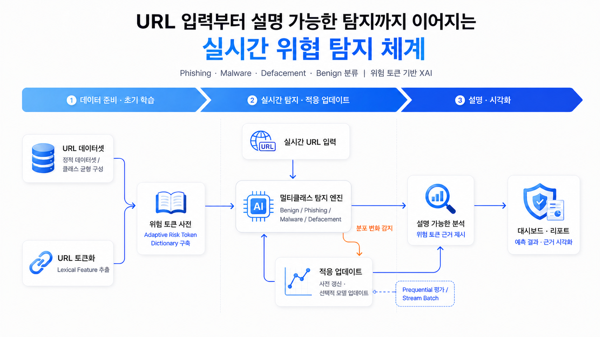

# LinkWatcher

> 학습 기반 위험토큰 사전, Transformer-token alignment, 정적 페이지 evidence를 결합한 XAI 기반 악성 URL 탐지 시스템

<br/>

## 프로젝트 개요

**LinkWatcher**는 URL을 입력하면 `benign`, `phishing`, `defacement`, `malware` 중 하나로 분류하고, 왜 그렇게 판단했는지 설명 가능한 근거를 함께 제공하는 웹 기반 URL 위험 탐지 시스템입니다.

본 프로젝트의 핵심은 단일 모델의 확률값만 사용하는 것이 아니라, 학습 데이터에서 생성한 위험토큰 사전, URL 문맥 기반 근거, Transformer의 토큰 중요도, 그리고 정적 페이지 분석 결과를 결합하여 최종 위험도를 산출하는 것입니다.

즉, 단순히 “위험 단어가 포함되었는지”만 보는 것이 아니라 해당 토큰이 도메인, 경로, 쿼리, 파일 확장자 중 어디에 등장했는지와 주변 문맥을 함께 고려합니다.

<br/>

## 아키텍처

현재 구현된 서비스의 아키텍처는 다음과 같습니다.



1. URL 데이터셋과 URL 토큰화를 기반으로 위험 근거 통합 모듈을 구성합니다.
2. 사용자가 실시간으로 URL을 입력하면 멀티클래스 탐지 엔진이 URL을 분류합니다.
3. 탐지 결과는 위험 사전, URL 문맥, Transformer 중요도, 정적 페이지 evidence를 결합한 XAI 모듈로 전달됩니다.
4. 프론트엔드에서는 예측 결과와 토큰별 근거, 결정 근거, 정적 페이지 evidence를 시각화합니다.

<br/>

## 제안 모델

최종 모듈은 다음 evidence를 결합합니다.

- `LearnedURLLexicon`: 학습 데이터에서 생성한 위험토큰 사전 기반 근거
- `TransformerLexiconAlignment`: Transformer가 중요하게 본 토큰과 위험토큰 사전의 정렬 정도
- `StaticPageEvidence`: HTML, form, password input, 외부 form action, SSL, defacement text 등 정적 페이지 근거
- `URL Context Rules`: 토큰 위치, 파일 확장자, IP host, 쿼리/경로 문맥 등 URL 구조 기반 보정

<br/>

## 최종 위험도 수식

최종 판정은 다음 evidence fusion score를 기준으로 산출됩니다.

```text
Risk(x) = max(
  0.40 * LearnedURLLexicon(x)
+ 0.25 * TransformerLexiconAlignment(x)
+ 0.35 * StaticPageEvidence(x),
  strong evidence floor
)
```

각 항목의 의미는 다음과 같습니다.

- `LearnedURLLexicon(x)`: 학습 데이터에서 생성된 `risk_dict.json` 기반 URL 위험토큰 점수
- `TransformerLexiconAlignment(x)`: Transformer가 중요하게 본 토큰이 학습 위험토큰과 얼마나 정렬되는지 나타내는 점수
- `StaticPageEvidence(x)`: HTML, form, password input, 외부 form action, SSL, defacement text 등 정적 페이지 근거 점수
- `strong evidence floor`: URL 또는 페이지에서 강한 위험 근거가 발견될 때 위험도가 과도하게 희석되지 않도록 하는 보정항

페이지 evidence가 수집되지 않았거나 HTML 분석이 제한된 경우에는 해당 한계를 XAI 결과에 함께 표시합니다.

<br/>

## 토큰별 XAI 수식

상세보기 화면에서는 토큰별 설명 점수도 함께 제공합니다.

```text
E_i = (0.45*A_i + 0.30*D_i + 0.25*K_i) * R_i
```

- `A_i`: Transformer/token saliency
- `D_i`: 위험 사전 기반 dictionary score
- `K_i`: 유사 사례 기반 score
- `R_i`: URL 문맥/규칙 기반 보정 계수

이를 통해 단순한 모델 confidence가 아니라, 어떤 토큰과 URL 구조가 설명에 기여했는지 확인할 수 있습니다.

<br/>

## XAI 출력

상세보기 화면에서는 다음 정보를 제공합니다.

- URL risk label
- 모델 confidence
- Evidence strength
- 학습 위험토큰 사전 기반 근거
- Transformer-token alignment 점수
- 정적 페이지 evidence
- 토큰별 중요도와 설명 점수
- decision-level evidence graph
- token evidence graph
- 유사 URL 사례
- 제안 수식과 세부 score

즉, 단순히 `phishing` 또는 `benign`만 출력하는 것이 아니라, 어떤 URL 토큰과 페이지 구조가 판정에 영향을 주었는지 함께 확인할 수 있습니다.

<br/>

## 현재 한계

- 다운로드 파일의 실제 바이너리 내용은 분석하지 않습니다.
- JavaScript 실행 후 동적으로 변하는 페이지는 완전 분석하지 않습니다.
- 실시간 사용 중 모델이 자동으로 계속 재학습되는 구조는 아닙니다.
- live page evidence는 네트워크 상태, 차단, DNS 실패, HTTP 오류에 영향을 받을 수 있습니다.


